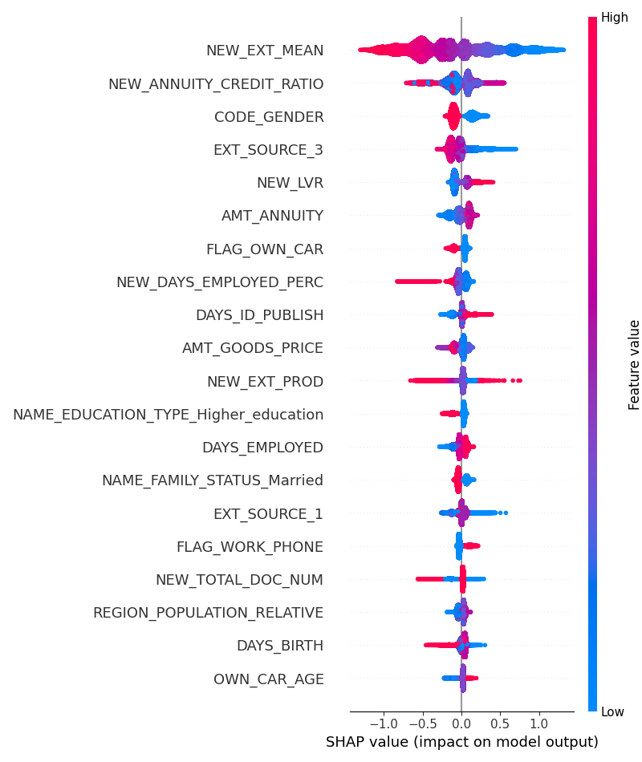
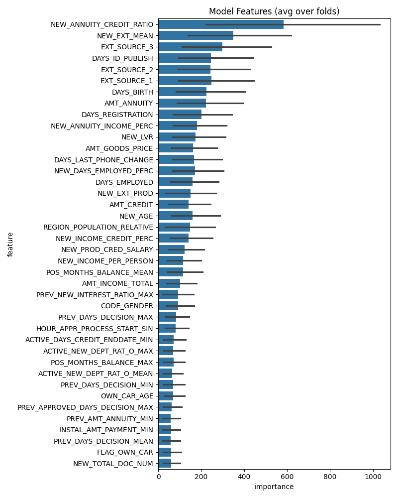

# Home-Credit-Risk-Prediction-with-XGBoost-LightGBM-and-CatBoost-Analysis-Credit-Default-Risk-Dataset

This project is focused on predicting credit default risk using advanced machine learning models and feature engineering techniques. By leveraging **XGBoost**, **LightGBM**, and **CatBoost**, we aim to create robust and interpretable models that can effectively predict whether a customer will default on their loan. Using the **Home Credit Default Risk** dataset, we applied key steps such as handling missing data, addressing class imbalances, and utilizing SHAP values for model explainability.

## 📋 Table of Contents
- [About the Project](#about-the-project)
- [Technologies Used](#technologies-used)
- [Dataset](#dataset)
- [Models](#models)
- [Feature Engineering](#feature-engineering)
- [Model Performance](#model-performance)
- [Installation](#installation)
- [Usage](#usage)
- [Contributing](#contributing)
- [License](#license)

---

## 📖 About the Project

In this project, we tackled key challenges in credit risk prediction, such as class imbalance, missing data, and the need for model transparency. Using the **Home Credit Default Risk** dataset, we trained three machine learning models—**XGBoost**, **LightGBM**, and **CatBoost**—and used SHAP values to interpret their decisions. The combination of advanced feature engineering and model optimization techniques resulted in high-performing and interpretable models, essential for use in financial institutions where model trustworthiness is critical.

This project provides a strong foundation for data scientists and machine learning engineers interested in financial risk analysis, particularly in credit risk prediction.

---

## 🚀 Technologies Used

The following technologies and tools were used to build and optimize the models:

- **Python**: The primary programming language used in this project.
- **XGBoost**: A gradient boosting framework that uses decision trees for classification and regression tasks.
- **LightGBM**: A highly efficient gradient boosting model known for its speed and performance on large datasets.
- **CatBoost**: Another gradient boosting model specifically designed to handle categorical data effectively.
- **SHAP** (SHapley Additive exPlanations): Used to provide insights into model decisions by calculating the contribution of each feature to a prediction.
- **Pandas**: For data manipulation and analysis.
- **NumPy**: For numerical computations.
- **Matplotlib** and **Seaborn**: For data visualization and plotting model results.

---

## 📊 Dataset

The project uses the **Home Credit Default Risk** dataset, which includes millions of credit applications, demographic information, and repayment performance data. This dataset allows us to build models that predict the likelihood of a customer defaulting on a loan.

- [Dataset Link (Kaggle)](https://www.kaggle.com/c/home-credit-default-risk/data)

Key features in the dataset include:
- **Financial indicators**: Information about credit amounts, annuities, and total income.
- **Demographic data**: Includes age, gender, and employment details.
- **Behavioral data**: Features such as phone changes, last employed days, and past loan applications.

### Data Preprocessing:
- **Handling Missing Data**: We used mean imputation, median imputation, and categorical filling for missing values.
- **Feature Engineering**: We created additional features such as `NEW_EXT_MEAN`, `NEW_ANNUITY_CREDIT_RATIO`, and various others to improve model performance.
- **Addressing Class Imbalance**: Techniques such as SMOTE (Synthetic Minority Over-sampling Technique) were used to balance the dataset.

---

## ⚙️ Models

Three machine learning models were employed for this project:

1. **XGBoost**: Known for its ability to efficiently capture patterns in structured datasets, especially for tabular data like financial records.
2. **LightGBM**: Provides faster training times and reduced memory usage while maintaining competitive performance.
3. **CatBoost**: Specialized for datasets containing categorical features, allowing it to excel in situations where categorical data is prevalent.

Each model was tuned using hyperparameter optimization techniques such as grid search and random search to achieve optimal performance.

---

## 🛠️ Feature Engineering

In order to improve model performance, several feature engineering techniques were applied:

- **New Features**: Created features like `NEW_EXT_MEAN`, `NEW_ANNUITY_CREDIT_RATIO`, and `NEW_LVR` to provide better insights for the models.
- **Handling Outliers**: Outliers were removed or transformed to prevent them from distorting the model predictions.
- **Normalization/Scaling**: Applied feature scaling techniques such as Min-Max Scaling to ensure that features are on a similar scale for gradient-boosted tree models.

---

## 📈 Model Performance

The models were evaluated using various performance metrics such as **AUC (Area Under the Curve)** and **ROC (Receiver Operating Characteristic)** curves. Below are the performance metrics for each model:

| Fold | XGBoost AUC | LightGBM AUC | CatBoost AUC |
|------|-------------|--------------|--------------|
| 1    | 0.767605    | 0.766413     | 0.763284     |
| 2    | 0.767605    | 0.766413     | 0.763284     |
| 3    | 0.767605    | 0.766413     | 0.763284     |
| 4    | 0.767605    | 0.766413     | 0.763284     |
| 5    | 0.767605    | 0.766413     | 0.763284     |

- **Full AUC score**: 0.773854
- **Ensemble Model Runtime**: 3762 seconds
- **Total Model Training Runtime**: 3974 seconds

### SHAP Analysis

The **SHAP** values were used to explain the contribution of each feature to the model’s decisions, ensuring transparency:

- Features such as `NEW_EXT_MEAN` and `NEW_ANNUITY_CREDIT_RATIO` played critical roles in the model's predictions.
- **SHAP** analysis provided clear insights into how and why the models made specific predictions, which is essential for use in sensitive applications like credit risk.

#### SHAP Feature Importance Plot

Below is the SHAP feature importance plot showing the contributions of different features to the model’s predictions.



#### Model Performance Visualization

Here’s a visual comparison of model performance (AUC scores) across **XGBoost**, **LightGBM**, and **CatBoost** models:



---

## 💻 Installation

To run this project locally, follow the steps below:

### Requirements
- Python 3.7+
- Libraries: `Pandas`, `NumPy`, `XGBoost`, `LightGBM`, `CatBoost`, `SHAP`, `Matplotlib`, `Seaborn`

### Steps

1. **Clone the repository**:
    ```bash
    git clone https://github.com/your_username/your_project_name.git
    ```

2. **Install the required libraries**:
    ```bash
    pip install -r requirements.txt
    ```

3. **Download the dataset** from Kaggle and place it in the `data/` directory.

4. **Run the Jupyter notebooks** for training:
    Navigate to the `notebooks` folder and execute `model_training.ipynb` to train the models and evaluate the results.

---

## 🔧 Usage

1. Download the dataset from Kaggle: [Home Credit Default Risk](https://www.kaggle.com/c/home-credit-default-risk/data)
2. Place the dataset in the `data/` folder.
3. Train the model by running:
    ```bash
    python train_model.py
    ```
4. Analyze model results:
    ```bash
    python analyze_results.py
    ```

---

## 🤝 Contributing

Contributions are welcome! If you would like to contribute to this project, please fork the repository and submit a pull request. Alternatively, open an issue for further discussions.

---

## 📄 License

This project is licensed under the **MIT License**. For more details, please refer to the [LICENSE](LICENSE) file.
